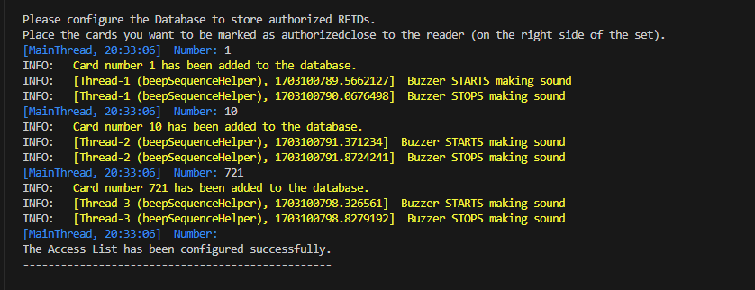
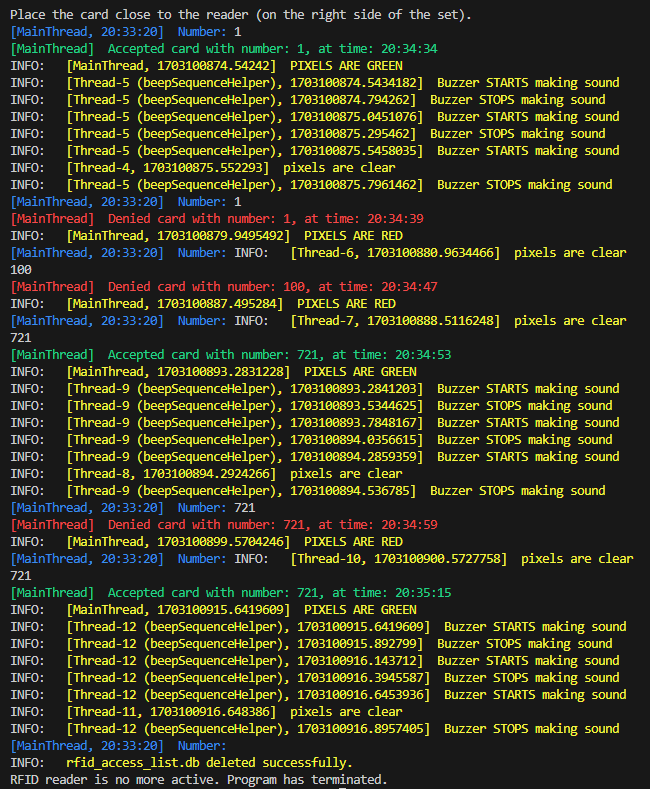

# Raspberry Pi - laboratory class No. 10

## Introduction
During this lab class we were supposed to solve two tasks:
- First one refered to handling the OLED display attached to the Raspberry Pi set.
- Second one aimed to teach us working with a RFID card reader.

### Task No. 1
#### Instruction
Program should display values [temperature, humidity and atmospheric pressure] from the BME280 sensor on the OLED screen. There should be always only one value displayed at the time. Along with the value a proper icon/image should be displayed [temp -> sun, pressure -> mountains etc., I didn't upload those images into this repository]. Pressing the buttons allows switching between screens: green button -> 1 screen to the right, red button -> 1 screen to the left.

#### Solution
Our implementation [file `Task_1.py`] is straightforward here. We added also a functionality that after pressing both buttons simultainously the program terminates and the OLED display is being cleared. We achieved that by listening and detetecting button presses in another threads and react to them properly. It is also very easy to change the duration of this *window* in which two not-simultainous presses will be considered as simultainous.

### Task No. 2
#### Instruction
Program should behave like a RFID card reader. After reading an authorized card it should make a proper sound with a buzzer and light up the LEDs on the green color for specific periof of time. After reading an unauthorized card buzzer should make also some specific sound and LEDs should became red for some time. However, after reading a card (and accepting / denying it), program should not react to reading the same card during 5 seconds following the last reading of this card. After every successfull reading of the card, its number should be displayed in the terminal.

#### Solution - main
Our implementation [files `Task_2.py`, `buzzer.py`, `leds.py`] uses a simple SQLite database to store the authorized card numbers [it was not needed here, a simple dictionary would be enough but it aimed to test the behaviour and performance of the SQLite database in the IoT program because it might be needed later in the final project]. At the beginning it prompts the user to present those cards that later should be considered as *trusted*. After pressing the green button, the (let's say) `Access list` is configured. Then the main program is running until the user presses two buttons simultainously (as in the task No. 1). It uses the database and a dictionary to store pairs [`cardID` : `cardReadTimestamp`] to remember last timestamps of the unauthorized card readings. `MainThread` of the program delegates handling the buzzer and LEDs interactions to the other threads so the card reader is always available. Those other threads start in the functions defined inside `buzzer.py` and `leds.py` scripts.

#### Solution - demo
Solution described above was also rewritten to be tested without the Raspberry Pi set. It uses only the terminal and printing / logging, just to show that the basic logic is implemented properly. Screenshots below are a simple demonstration of that program which consists of: `tests.py`, `test_leds.py` and `test_buzzer.py`.

#### Demo

  

  

