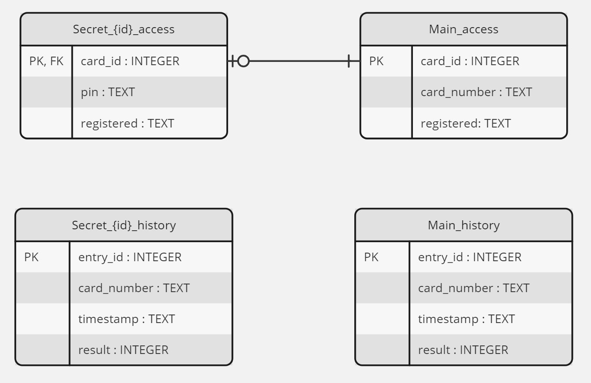
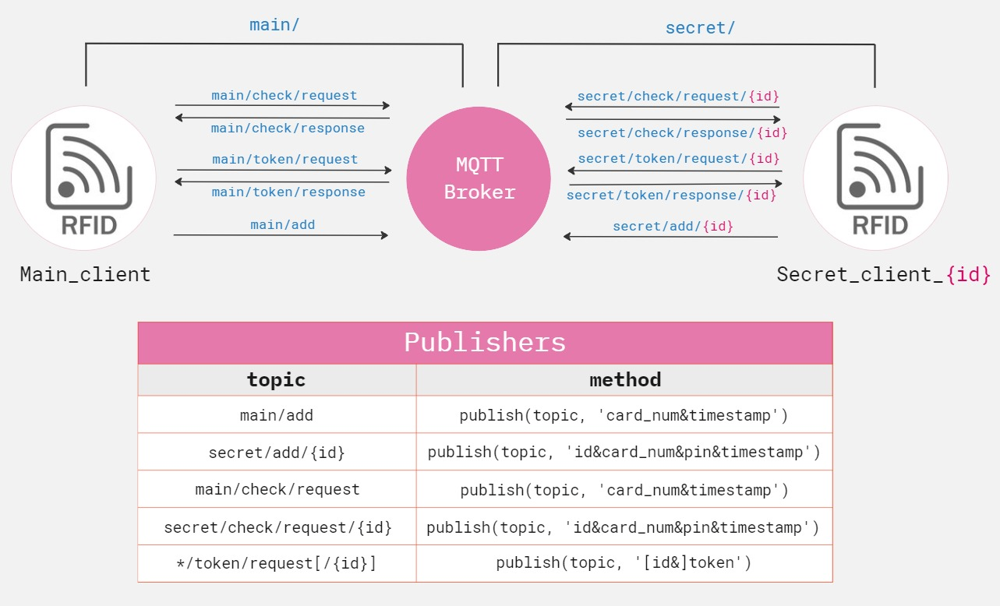

# IoT lab class

> [!CAUTION]
> To configure moquitto broker navigate to its configuration file (`/ect/mosquitto/mosquitto.conf`):
> >  sudo nano /ect/mosquitto/mosquitto.conf
> Add the following lines:
> >  allow_anonymous true
> >  listener 1883 0.0.0.0
> Start the service:
> >  sudo systemctl start mosquitto.service

## Access Control Project with RFID Cards and MQTT Protocol
** Project Description
This project is an implementation of an access control system that allows you to manage access to various rooms using RFID cards and the MQTT protocol. This system can be customized for different needs and applications.

** Requirements
Hardware

Raspberry Pi (or another compatible microcomputer)
RFID card reader (MFRC522)
LED lights (for access or denial indication)
Buzzer (for audio feedback)
OLED display (optional)
Other electronic components as needed

Software

Python 3
paho-mqtt library (for MQTT protocol handling)
Other dependencies can be found in the requirements.txt file

** Installation and Configuration
**
Clone this project to your Raspberry Pi device.
Install all required dependencies by running pip install -r requirements.txt.
Configure the necessary parameters, such as the MQTT broker address and other settings in the config.py file.
Properly connect all hardware components, such as the RFID card reader, LED lights, buzzer, etc.
Run the main project script using python main_client.py and/or python secret_client.py as needed.

** User Instructions
**
Hold an RFID card in front of the reader to open the door to the room.
If an additional PIN is required, enter it on the OLED display and confirm with a button press.
The system will automatically register the access and react accordingly (LED lights, sound, etc.).
You can monitor access records via the MQTT broker or the user interface on the OLED display.

## MQTT scheme

  

## Database diagram

  

